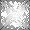

# Image to map

This script takes as argument a path to a maze and converts it into a map.txt to be used with the assignment.

This image maze should be black and white. Here's an example:



The script adds a 3-order house in every white pixel found along the borders of the image and an starting cell and pizza shop in the positions (0,0) and (2,0) respectively.

## Getting started

Python 2.7 is recomended.Uses the following dependencies:

- imageio: `pip install imageio`

Start the program with:

```bash
python imagetomap.py /path/to/image/maze
```

This will print the maze into console. To save it into a file, redirect the standard output into a file:

```bash
python imagetomap.py /path/to/image/maze > map.txt
```

## Authors
- Álvaro Galisteo
- Javier Fernandez
